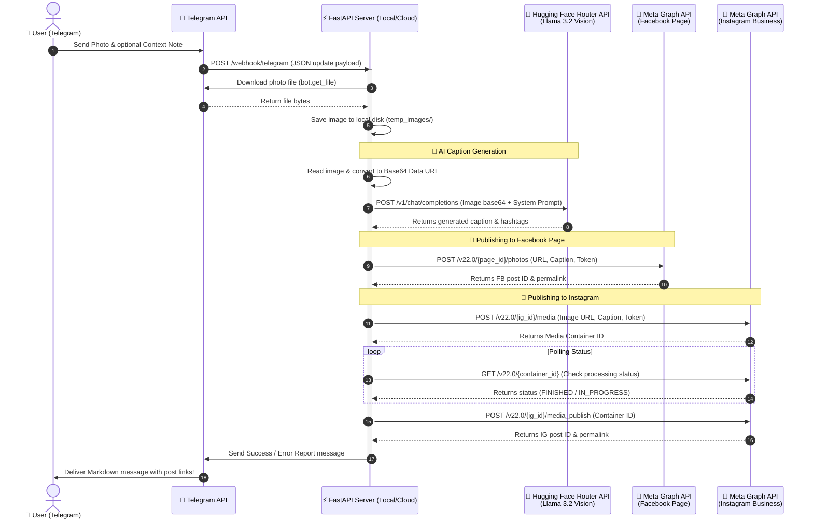

# 🏕️ Social Media AI Agent — State Park RV Village

An AI-powered social media posting agent designed to help **State Park RV Village** (Lockhart, TX) grow its organic following. Send a photo to the Telegram bot, and it will analyze the image using AI, write an engaging brand-aligned caption, and publish it concurrently to both **Instagram Business** and **Facebook Page**.

---

## 🤖 How It Works



---

## 🛠️ Prerequisites & Setup

You will need access tokens for three platforms: Telegram, Hugging Face, and Meta (Facebook/Instagram).

### 1. Telegram Bot Token
1. Open Telegram and search for [@BotFather](https://t.me/BotFather).
2. Use the `/newbot` command to create a new bot.
3. Save the **HTTP API Token** generated.

### 2. Hugging Face Token (AI Caption Model)
1. Register/Log in to [Hugging Face](https://huggingface.co/).
2. Go to **Settings** -> **Access Tokens** -> **Create New Token** (read permission is sufficient).
3. Save the token (starts with `hf_...`).

### 3. Meta Credentials (Instagram & Facebook)
1. **Instagram Business Account**: Ensure your Instagram account is switched to a **Business/Professional** account and linked to a **Facebook Page**.
2. **Meta Developer App**:
   - Create an app on the [Meta Developer Portal](https://developers.facebook.com/apps/).
   - Under **Use cases**, add **Manage messaging & content on Instagram** and **Manage everything on your Page**.
   - Customize the Page use case to add `pages_manage_posts`, `pages_read_engagement`, and `pages_show_list` permissions.
3. **Generate Page Access Token & ID**:
   - Open the **Graph API Explorer** tool.
   - Select your Facebook Page in the **User or Page** dropdown.
   - Grant permissions and generate the Access Token (starts with `EAA...`).
   - Copy the Page ID and Page Access Token.
4. **Get Instagram Account ID**:
   - Query `GET /me/accounts?fields=instagram_business_account` inside the Explorer to retrieve the connected Instagram Business account ID.

---

## 🚀 Local Development

### 1. Installation
Clone the repository, create a virtual environment, and install dependencies:
```bash
git init
python3 -m venv venv
source venv/bin/activate
pip install -r requirements.txt
```

### 2. Configure Environment Variables
Copy `.env.example` to `.env` and fill in your keys:
```bash
cp .env.example .env
```

Ensure `.env` contains:
```env
TELEGRAM_BOT_TOKEN="your-telegram-token"
HUGGINGFACE_API_TOKEN="your-huggingface-token"
INSTAGRAM_ACCOUNT_ID="your-instagram-account-id"
INSTAGRAM_ACCESS_TOKEN="your-instagram-access-token"
FACEBOOK_PAGE_ID="your-facebook-page-id"
FACEBOOK_PAGE_ACCESS_TOKEN="your-facebook-page-access-token"
WEBHOOK_BASE_URL="https://your-ngrok-url.ngrok-free.app"
```

### 3. Run ngrok (Local tunnel)
Since Meta and Telegram APIs communicate via webhooks, they must be able to reach your local server. Run ngrok to tunnel port 8000:
```bash
ngrok http 8000
```
Copy the `https://...` forwarding address and update `WEBHOOK_BASE_URL` in `.env`.

### 4. Start the Application
```bash
python main.py
```
On startup, the application will automatically register the webhook URL with Telegram. You will see:
```
✅ Telegram webhook set successfully
🚀 Server is ready! Waiting for photos on Telegram...
```

---

## 📱 Usage Guide
1. Go to your Telegram bot chat and press `/start`.
2. Send a photo. You can add a caption with the photo to provide **custom context** (e.g., *"Our new long-term RV site hookups are ready!"*).
3. The bot will:
   - Download the photo.
   - Run image-to-text analysis using the **Qwen 3 VL / Llama 3.2 Vision** model on Hugging Face.
   - Generate a professional RV park marketing caption tailored to Lockhart, TX, complete with CTAs, emojis, and hashtags.
   - Post it concurrently to both Instagram and Facebook.
   - Reply to you in Telegram with links to view both live posts.

---

## ☁️ Live Cloud Deployment (Railway / Render)
To make your agent run 24/7 without needing your laptop active:

1. **Deploy to Render or Railway**:
   - Push your code to a private GitHub repository.
   - Create a new web service on Railway or Render pointing to the repository.
   - Command to run: `uvicorn main:app --host 0.0.0.0 --port $PORT` (or just `python main.py`).
2. **Configure Environment Variables**:
   - Copy all variables from `.env` to the host's environment settings.
   - Set `WEBHOOK_BASE_URL` to the public domain given to you by the hosting provider (e.g., `https://statepark-rv-bot.up.railway.app`).

*Note: Ephemeral file storage on cloud platforms is perfectly fine. The image is downloaded to `temp_images/` only long enough for Instagram and Facebook to scrape it into their permanent CDNs, which happens instantly when the publish endpoints are triggered.*
